# PROSES / LANGKAH - LANGKAH PRAKTIKUM 9

# Exception Handling 
- Execption handling atau (eksepsi) adalah merupakan suatu kesalahan ( eror) yang terjadi atau yang telah di lakukan pada saat proses eksekusi program sedang berjalan.

- Kesalahan ini dapat menyebabkan program
 yang di buat tidak berakhir dengan normal

# Handling

- Yaitu penangan file adalah bagian yang sangat penting dari aplikasi apapun

# Assertion
- Assertion atau biasa sering di sebut (pernyataan) adalah kewajaran yang ada di dalam program yang bisa di atur aktif dan non aktif ketika pada saat selesai menjalankanya program

# The assert Statement

- Pada saat kita menemukan pernyataan, Python dapat mengevaluasi ekspresi yang menyertainya, Yang mana bisa benar bisa salah. Jika ekspresi tersebut salah maka python akan memunculkan AssertionError

- assert Exspression[, Argument]

Jika pernyataan gagal maka python akan menggunakan ArgumentExpression yaitu sebagai argumen untuk AssertionError. AssertionError juga dapat ditangkap dan ditangani seperti pengecualian lainya menggunakan try- , Tetapi ketika kita biarkan mereka akan menghentikan program tersebut maka akan menghasilkan backtrace

# Contoh

- Berikut adalah fungai yang untuk mengubah suhu derajat kelvin menjadi derajat Fahrenheit

- Kode program beserta hasil nya

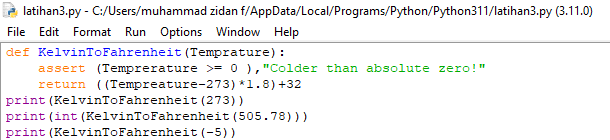

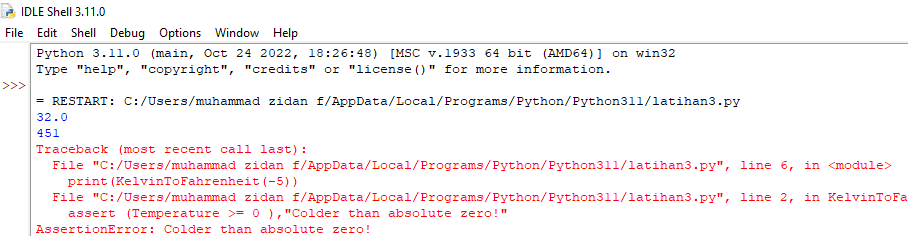

# Ketika kita dalam menangani pengecualian 

Jika kita memiliki kode yang kemungkinan mencurigakan yang mungking dapat mengeluarkan pengecualian anda dapat menggunakan - try:box setelah itu sertakan - - except: statement

# Contoh

- Pada saat kita ingin membuka file menulis konten file dan keluar dari file tersebut dengan aman

- Kode program beserta hasil nya

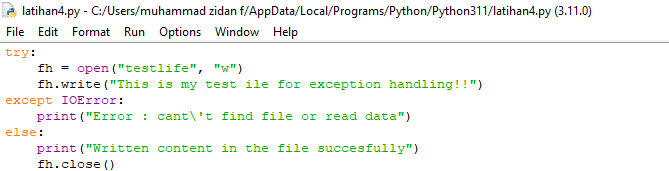

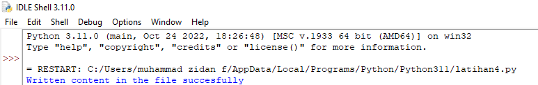

- Contoh membuka file yang kita tidak dapat memiliki akses atau izin sehingga kita dapat membuat pengecualian

- Kode program dan hasil nya

# Fasal kecuali tanpa pengecualian

- kita dapat menggunakan pernyataan execption tanpa exception 

try:

You do your operatons here;

.......................................

except:

If there is any exception, then execute this block.

......................................

else:

If there is no exception then execute this block.

Pernyataan coba kecuali ini menangkap semua pengecualian yang ada menggunakan percobaan try-except pernyataan tidak di bisa di anggap sebagai praktik dalam pemrograman yang baik karena dapat memunculkan pengecualian 

# Klausa kecuali menggunakan berbagai pengecualian

- Kita juga dapat menggunakan pertanyaan exception yang kurang lebih sama

 try:
 
You do your operatons here;

.......................................

except(Exception1[, Exception2[,...ExceptionN]]]):

If There isbany exception from the given exception list,

Then execute this block.

......................................

else:

If there is no exception then execute this block.

# Contoh

- Pada saat coba kita tidak memiliki izin untuk dapat membuka file dalam model tulis yang juga dapat di tulis 

- Kode program dan hasil nya

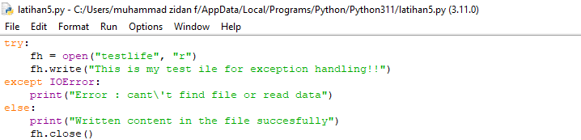

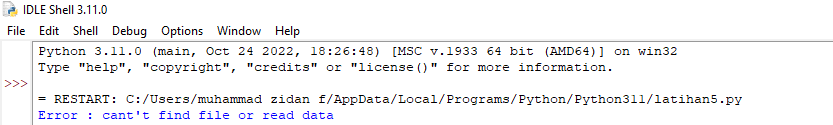

- Contoh ketika kita ingin di tulis lebih rapih

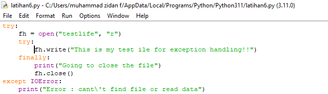

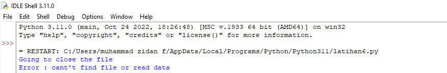

Pada saat kita ingin exception di lempar ke salam block try di lanjutkan dengan memblok setelau itu blok di eksekusi pengecualian tersebut di tangani dalam pernyataan kecuali jika terdapat lapisan yang lebih tinggi

# Argumen pengecualian

# Contoh

- contoh pengecualian

- Kode program dan hasil nya

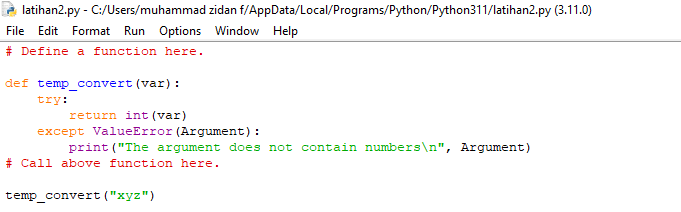

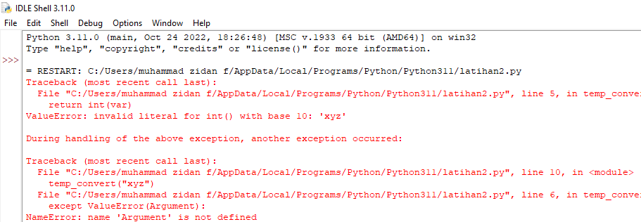

# Malempar pengecualian

# Contoh

- Pengcualian dapat merupakan string, kelas, objek kurang lebih hampir semua pengecualian python menimbulkan kelas, Dengan argument yang merupakan turunan kelas 

- Mendefinisikan pengecualian dengan kode program dan hasil sebagai berikut

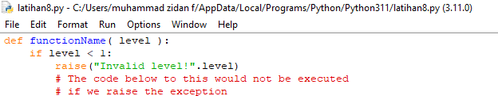

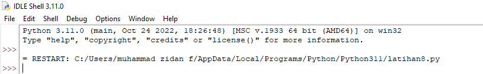

# Pengecualian yang di tetapkan

- Python juga dapat menguat pengecualian sendiri dengan kelas kelas 

- Contoh contoh dengan runtike eror dibuat yng merupakan subkelas berguna untuk menampilkan inforkasi saat pengecualian tangkap

- Kemudian di blok pengguna memunculkan dan di tangkap di blok kecuali variabel digunakan untuk membuat instance dari kelas network eror

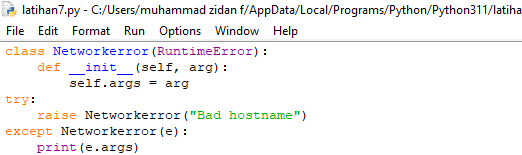

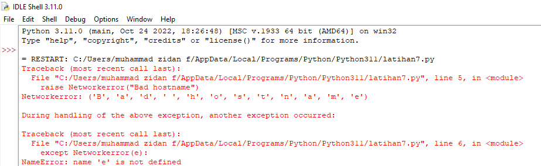
